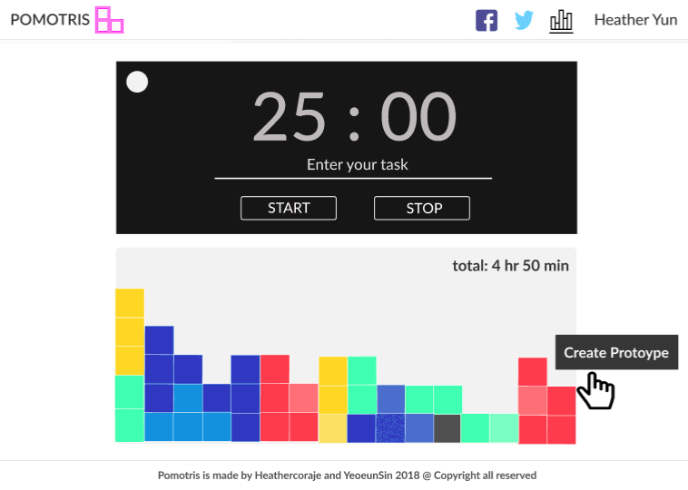
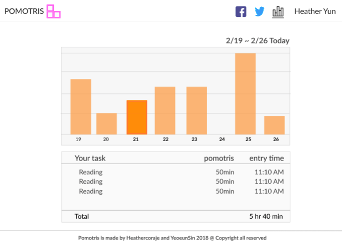
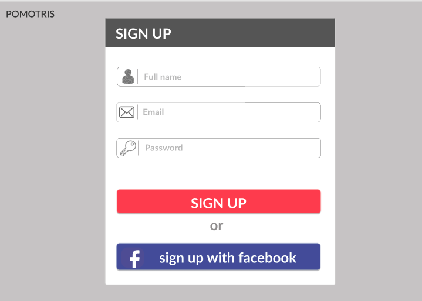
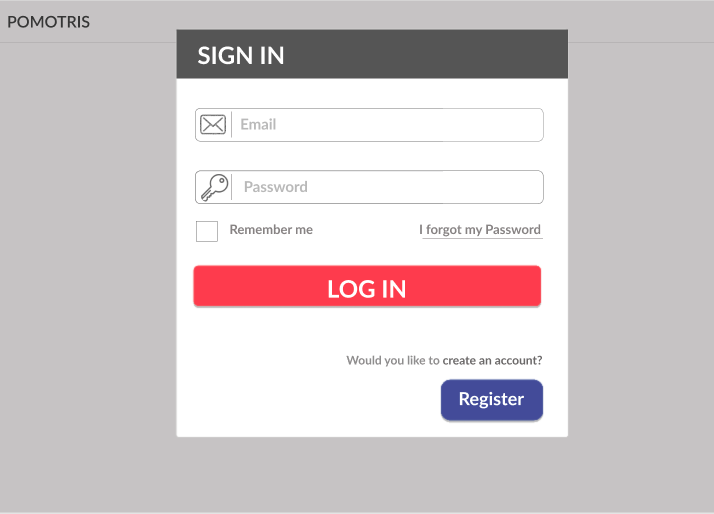

# Pomotris

### MVP

* A pomodoro clock with a setting option for each session (25 min, 30 min and 50 min)
* A tetris-looking chart to show how much time user spend
* A weekly bar chart to show a user how much time she has spent during the week
* A daily table report to show a user names of tasks on each pomotris session
* Signup and login

### Stretch goal

* OAuth with Facebook
* Share feature linked to Facebook and Twitter
* Admin mode to delete user and more

### Prototype

### Stack

* Frontend: HTML5, CSS, React.js
* Backend: Node.js with Express.js
* Database: MySQL
* Testing: Jest/Enzyme
* Atom & Github

### File system

### Architecture

### Design of code
